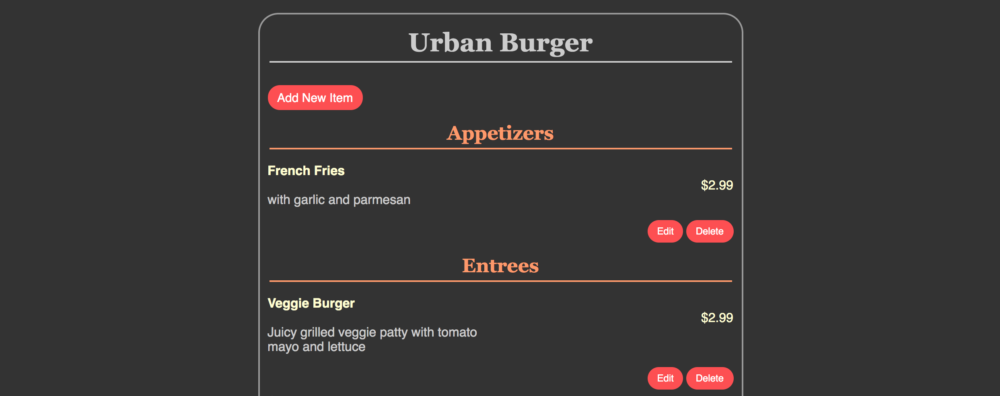
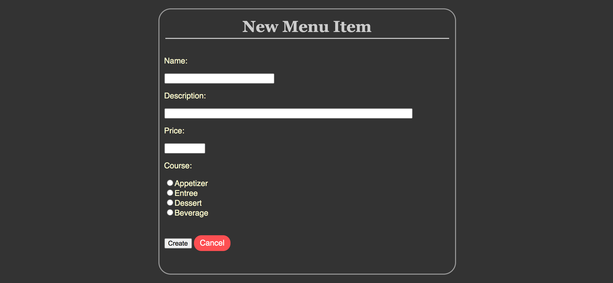
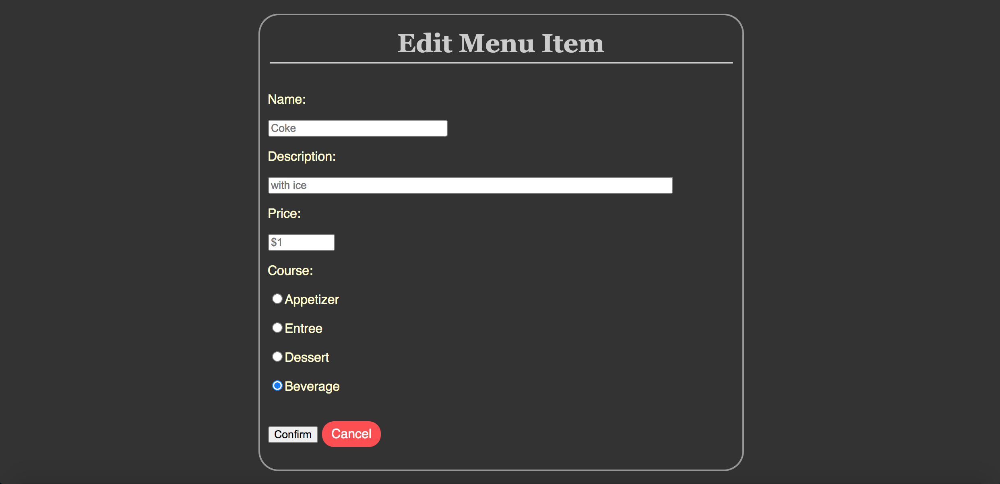
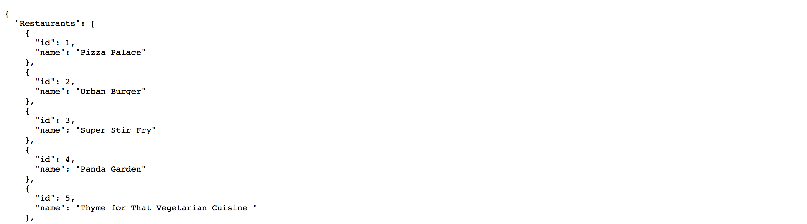
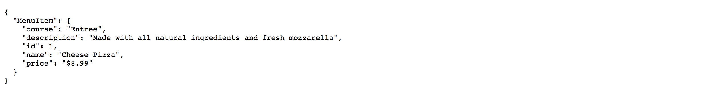

# Restaurant Menu Web App

## Summary

A web application based on Flask that queries a database using an Object-Relational Mapping (ORM) layer for items on restaurant menus and then dynamically generates complete menus in the form of web pages and REST API endpoints. The web app also allows CRUD operations for restaurants and menu items.

## Files in Repo

- `README.md`  
brief intro of the project

- `database_setup.py`  
set up the database to store restaurants and menu items data

- `restaurantmenu.db`  
database that stores restaurants and menu items data

- `lotsofmenus.py`  
contain some fake restaurants and menu items data

- `flaskmenu.py`  
based on Flask, set up routing, convert GET and POST requests to CRUD operations with SQLAlchemy statements, add message flashing to give users feedback immediately after a certain action, configure REST API endpoints to return JSON objects when clients send GET requests

- /templates  
contain html templates that methods in `flaskmenu.py` can render

- /static  
css file that styles all web pages

## How to Run

1. Run database_setup.py to create the database  
`python database_setup.py`

2. Run lotsofmenus.py to populate the database  
`python lotsofmenus.py`

3. Run flaskmenu.py and navigate to http://0.0.0.0:5000/ in your browser  
`python flaskmenu.py`

## Web App Functionalities

http://0.0.0.0:5000/, http://0.0.0.0:5000/hello, or http://0.0.0.0:5000/restaurants/ show all the restaurants

Add new restaurant

Edit existing restaurant name

Delete existing restaurant

http://0.0.0.0:5000/restaurant/%restaurant_id%, and http://0.0.0.0:5000/restaurant/%restaurant_id%/menu show all the menu items that restaurant has

If the restaurant doesn't have any menu item yet, show as below

Add new menu item

Edit existing menu item name, description, price, course

Delete existing menu item name

http://0.0.0.0:5000/restaurants/json, return JSON object for all restaurants

http://0.0.0.0:5000/restaurant/%restaurant_id%/menu/json, return JSON object for all menu items of the restaurant

http://0.0.0.0:5000/restaurant/%restaurant_id%/menu/%menu_id%/json, return JSON object for the menu item

