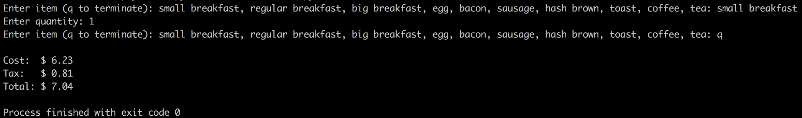
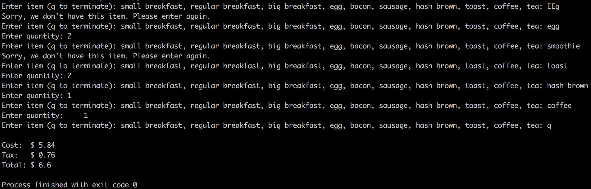
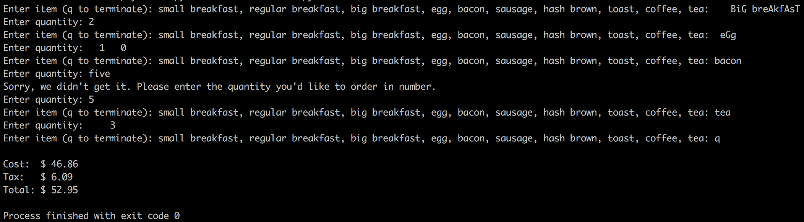

# Restaurant Order

## Summary

A program in Python that computes the cost of breakfast at the Good Morning America! restaurant.
The program prompts the user for breakfast item and quantity input and validate them before computing the results.

## Specific Functions

- The program prompts the user for various pieces of information about the desired breakfast.
Some of the information is dependent on the type of breakfast being ordered. Once all the information has been entered, the program will compute and display the amount of money (including tax) charged for the customer’s breakfast.

- The user can build a custom breakfast from the following individual food and beverage items: egg ($0.99 each), bacon ($0.49 per strip), sausage ($1.49 each), hash brown ($1.19 each), toast ($0.79 per slice), coffee ($1.09 per cup), and tea ($0.89 per tea bag).
E.g. the customer can order two eggs with two toasts and a cup of coffee.

- Alternatively, the customer can order a small, regular, or big breakfast:
  - <strong>Small breakfast</strong> includes 1 egg, 1 hash brown, 2 slices of toast, 2 strips of bacon, and 1 sausage.
  - <strong>Regular breakfast</strong> includes 2 eggs, 1 hash brown and 2 slices of toast, 4 strips of bacon, and 2 sausages.
  - <strong>Big breakfast</strong> includes 3 eggs, 2 hash browns, 4 slices of toast, 6 strips of bacon, and 3 sausages.
  - The prices for these breakfast choices are based on the prices of the individual food items that compose them.
  - The customer can add any of the food and drink items listed above to a small, regular, or big breakfast order. e.g. a customer may order a regular breakfast and add a coffee and an additional sausage to it.

- The program displays the available choices as shown below, and the user will type the customer’s choice. E.g. if the customer wants a big breakfast, the user will type: `big breakfast <enter>`. The program will then ask for the `quantity` (how many big breakfasts). The program continues to ask for additional menu items by re-displaying the choices. When the customer is done ordering, the user enters `q`, the program then displays the pre-tax total, the tax, and the total with tax. Other scenarios are possible, in which the customer decides to customize the breakfast order.
```
Enter item (q to terminate): small breakfast, regular breakfast, big breakfast, egg, bacon, sausage, hash brown, toast, coffee, tea:
```

- The program will compute the total cost of the order with additional taxes of 13%. All the costs are to be rounded to the nearest penny, and displayed with a dollar sign and two decimal positions. E.g. a total cost of 13.66666 will be displayed as $13.67.

- The program is able to compute the total breakfast cost for an entire table of customers. E.g. three customers may be sitting at the same table, where customer John orders the big breakfast with coffee, customer Jane orders the regular breakfast with an extra two strips of bacon and tea, and customer Linda chooses to have two eggs with two slices of toast and a strip of bacon. The user would enter the quantities for menu item, e.g. 1 big breakfast, 1 regular breakfast, 1 coffee, 1 tea, 2 eggs, 2 slices of toast, 3 strips of bacon.

- The program will always request user to choose menu item first and then for its quantity.

- The program accepts case insensitive inputs, e.g. "BiG breaKfasT" and "big breakfast" will both be accepted. Additionally, it can deal with leading and trailing spaces, including cases when multiple spaces separate words in input lines, e.g. "small breakfast" and " small &nbsp; &nbsp; breakfast " will both be accepted.

- The program can also detect and report invalid input. When menu item is requested, the program can check whether the input matches one of the provided menu items exactly (ignoring upper case and spaces). When quantity is requested, the program can validate whether the input is a number. When an invalid input is detected, the program will display an error message, and prompt for the input until the user enters it correctly.

## Example Runs

Run below code in terminal to start the Good Morning America! restaurant order program:

`python restaurant_order.py`


<strong> Order a Small Breakfast: </strong>


<strong> Order a Custom Breakfast: </strong>
<br>
Test entering wrong item name and item that doesn't exist


<strong> Order for a Table of Three Customers: </strong>
<br>
Test entering item name and quantity with leading and trailing spaces, spaces between words or integers; item name with uppercase letters; quantity not in numeric format

